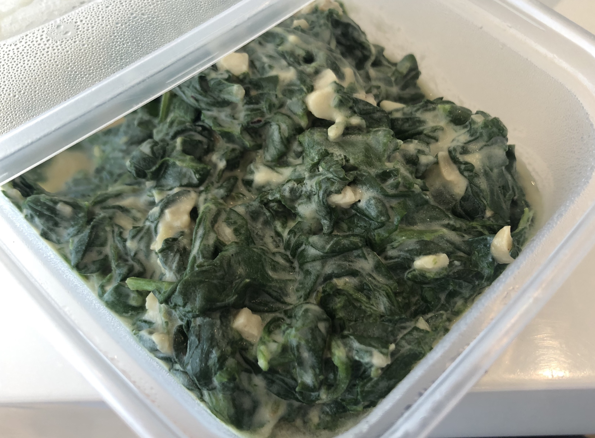

# Cream Baby Spinach

## 2020-02-27 試做 #3

- 兩包 tesco 買的 baby spinach 
- 無鹽奶油
- 6 瓣蒜頭
- 半顆小洋蔥

## 步驟

#### 煮菜
1. 深鍋開大火加入奶油融化
2. 加入 baby spinach，拌勻，蓋起來，維持大火
3. 每 30~45 秒開蓋攪拌，確認沒有燒焦
4. 約 4 分鐘後菜會全軟，拿出來瀝水放窗邊放涼
5. 放涼後用菜刀粗略切一下
6. 菜放餐巾紙上吸收多餘水分

#### 準備奶汁
1. 洋蔥 & 蒜頭切碎，用奶油煮到軟（所以奶油量不能太少）
2. 加入鹽胡椒調味
3. 加入牛奶 ?? ml (以後再量)，中小火收汁
4. 收汁到牛奶約剩一半的量，關火加入一點點起司

#### 合併
1. 放涼吸乾的菜加入奶汁中混合
2. 冷的菜會讓奶汁變濃稠，混合後不可再加熱，不然菜會出水稀釋湯汁

### Tips
- 網路上說奶汁再加牛奶前也可以先加麵粉炒成麵糊，但試過覺得不好吃
