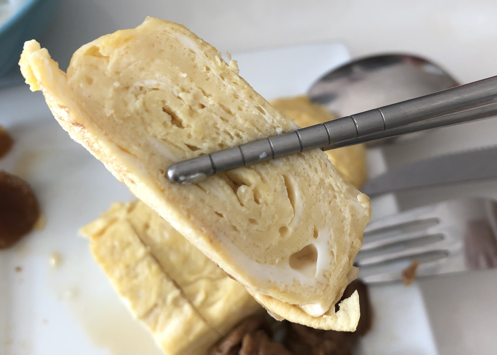

# 玉子燒

## 2020-02-29 平底鍋試做 #3
- 無鹽奶油
**蛋液**
- 4個蛋
- 40ml 水 + 昆布烹大師 (高湯)
- 2.5ml 味醂
- 5ml 昆布醬油
- 鹽少許 

## 步驟
1. 蛋液材料全部拌勻
2. 奶油加進鍋子加熱至全融（不要太少因為有機會沾鍋）
3. 一點點蛋液煎至即將全熟，折第一次
4. 再加蛋液，邊邊盡量推成直線兩頭會好看一點點
5. (*) 用鍋鏟 + 筷子盡量捲密一點
6. 每次蛋液量不要太多，盡量煎到到表面不要太水再開始卷，不然容易破掉
7. 全程中小火捲到蛋液用完

## Tips
1. MASA 葛格説 1顆蛋配 10ml 高湯，網路上也看到有人配 1 蛋 20ml 水。
2. 昆布粉可換鰹魚粉，但鰹魚粉不要太多不然會很搶味。

## References
MASA 比例：https://www.youtube.com/watch?v=4YR58rTjEe0&t=138s